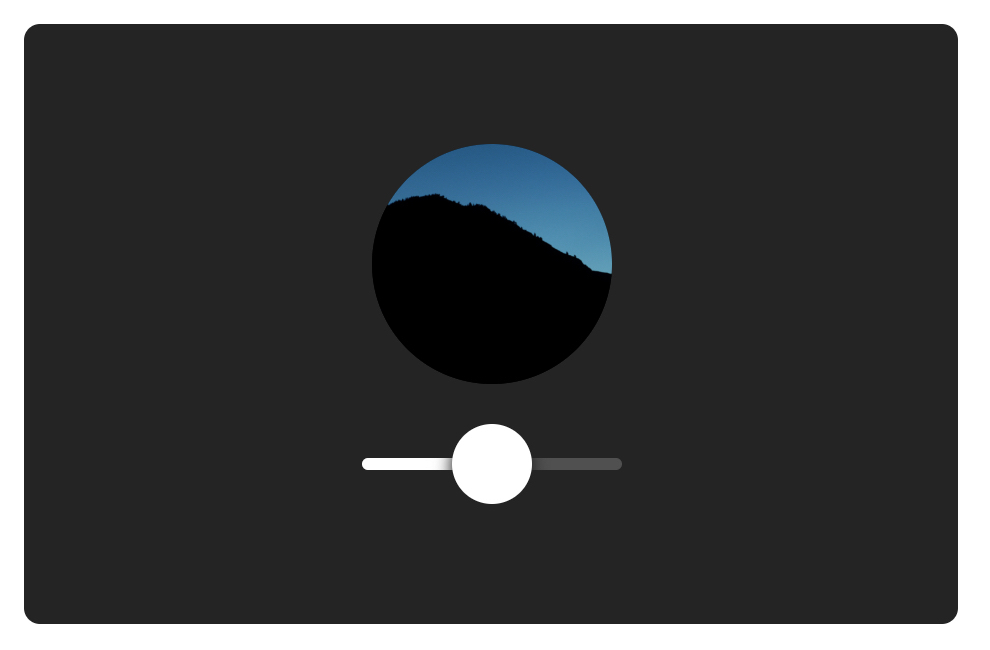

# 教程

在这个教程里，你会在利用Framer这个库用React创建一个非常有用的自定义的滑块组件。在这个教程里面用到的方法会让你对整个Framer的基本使用有一个更全面的了解。在你开始之前，看一下案例这样可以知道你到底要在这个教程里面做一个什么东西。

## 总览

### 你会学到什么

* 布局及视觉化的属性
* 拖拽属性
* 使用React Hooks
* MotionValue功能的使用
* 设置默认的属性及值
* 传递组件的数据
* 转换MotionValue生成的数据

当你不停地往前推进时，教程内容的难度也会相应地提高，你一定要尽你所能去完成它。你也不必把这个案例全部做完才会有收获。享受学习的过程，同时当你觉得被难住的时候可以来我们的社区寻求帮助。

#### 让我们开始吧！

