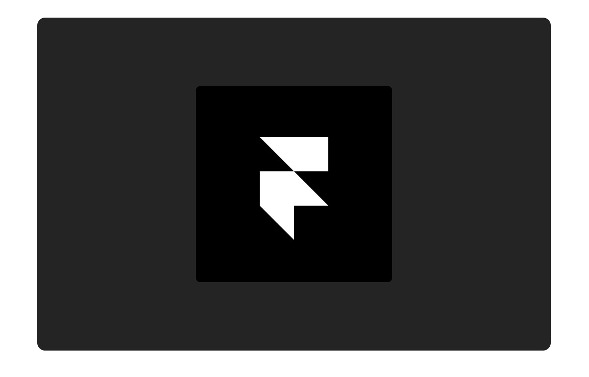

# 准备 Setup

我们已经准备好了初始文件，分别是CodeSandbox的形式和Framer X文件，它们都已经引用了Framer的库，你可以直接选择你想要的方式快速开始。

[点击下载Framer X文件](http://static.framer.com/api/tutorial-start.framerx)

[点击打开CodeSandbox](https://codesandbox.io/s/rrlpv8lo3m)

 - **CodeSandbox：**打开之后fork一份到自己的CodeSandbox中。

 - **Framer X：**下载文件并且在本地的FramerX中打开。

这两种的初识项目里面都包含了两个React文件：**index.tsx**和**Slider.tsx**。一旦你准备好了，就让我们来看一下这两个文件里都有什么。



### Index.tsx

这个文件能确保你整个项目能正常渲染。它同时也是你最顶层的组件。让我们来看看我们都为你准备了什么。

 - 首先我们在文件的顶部引入了React, render 和 Frame

 - 然后App\( \) 组件返回了作为SliderApp的Frame标签，这个标签被设置成了宽和高都是100%\(width={"100%"},height={"100%"}\)，也就是说它的尺寸可以充满了整个显示设备。我们同时给他设定了一个灰色背景\(background={"\#242424"}\)以及一个名称（name={"SliderApp"}）来帮助我们来识别它。

 - 在它里面是一个占位用的Frame标签，它有一张被设置为居中（center）的logo图片（image={"[https://static.framer.com/api/logo.jpg"}](https://static.framer.com/api/logo.jpg"})），同时图片的圆角是4px（radius={4}）

 - 在最后一行，我们用render\( \) 方法把App组件渲染到了你html文件中的id名称为root的标签内部

如果你是用Framer X做这个练习的话，文件里面是不会包含最后这一行render方法的，也不会有render的引用，因为Framer X软件已经通过一些内部机制自动帮你实现了。

```jsx
import * as React from "react"
import { render } from "react-dom"
import { Frame } from "framer"

export function App() {
  return (
    <Frame
      name={"SliderApp"}
      width={"100%"}
      height={"100%"}
      background={"#242424"}
    >
      <Frame
        center
        image={"https://static.framer.com/api/logo.jpg"}
        radius={4}
      />
    </Frame>
  )
}

render(<App />, document.getElementById("root"))
```


### Slider.tsx

这就是写你的Slider组件的文件。你在教程中大部分的代码都会在这里完成。选择这个文件，看看我们都已经在里面帮你写好了什么。

 - 首先是引入了React 和 Frame 

 - 然后是导出了Slider这个组件。

 - 这个组件返回了一个默认初始的Frame标签

```jsx
import * as React from "react"
import { Frame } from "framer"

export function Slider() {
  return <Frame center />
}
```

