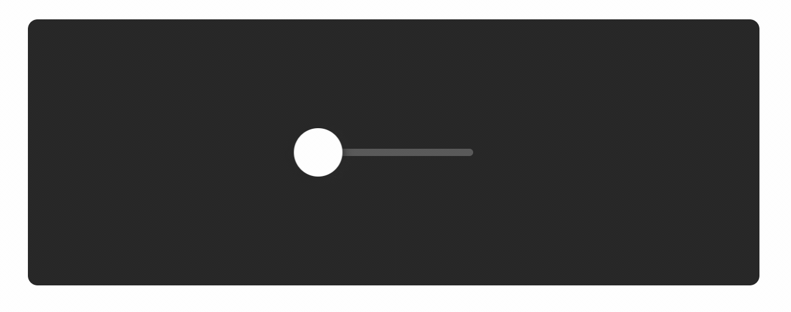

# 拖动 & MotionValue

当滑块被拖动的，滑块在水平方向上的X坐标值就应该是进度条的宽度值。这样的话，在后面也可以利用这一点做一些数值的运算来实现后面想要的实现的功能。要想实现这滑块的水平坐标值和进度条宽度的联动，你需要去给滑块的Frame标签添加一个写属性同时利用一下MotionValue这个功能。




### 让滑块可以拖动 Add Knob Dragging

首先你要给滑块的Frame标签设置一个drag属性，并且把值设定为X，这样你就可以在水平方向上任意拖动了。不过你需要给滑块设置一个可以拖动的范围，不然一不小心拖动到外星去了，也不是你想要的结果，所以，用dragConstraints 这属性设置一下可以拖动的范围，而这个范围刚好是轨道的长度。

为了改善一下你拖动时的体验，你需要去设置一下dragElastic和dragMomentum这两个属性，前者是控制拖动之后的弹性效果，后者是控制滑块运动的惯性。

现在这个滑块可以从轨道的左边拖到右边了，也就是说当你拖动滑块的时候，它的x属性的值是从0到130变化的。那么接下去，我们就要把滑块的x属性的值和一个MotionValue的值绑定一下，让他们产生连接。

```jsx
<Frame
  name={"Knob"}
  size={40}
  center={"y"}
  radius={"50%"}
  background={"#fff"}
  shadow={"0 2px 8px 1px #242424"}
  left={-20}
  drag={"x"}
  dragConstraints={{ left: 0, right: 130 }}
  dragElastic={0}
  dragMomentum={false}
/>
```


### 添加一个MotionValue

要想使用MotionValue你得首先在Slider文件的顶部引入这个功能模块。一旦引入了，你就可以动手使用它了。

* 在引入Frame的位置后面机上一个useMotionValue
* 在组件内部分位置命名一个positon的变量，执行useMotionValue这方法并且传一个0作为初始值给position这个变量

现在你就可以利用position这个变量实现滑块横坐标值和进度条宽度值得联动了。当你把这个position变量赋值给滑块的x属性，那么当你的滑块拖动时，滑块的x属性的值就会实时地被传到position这个变量里。

这样的话，你就可以用这个MotionValue功能来实现滑块x的属性值和进度条的宽度保持同步了，接下去你就会知道如何设置了。

```jsx
import * as React from "react";
import { Frame, useMotionValue } from "framer";

export function Slider() {
  const position = useMotionValue(0);
  return (
    <Frame name={"Rail"}
      ...
    >
      <Frame
        name={"Fill"}
        ...
      />
      <Frame
        name={"Knob"}
        ...
      />
    </Frame>
  );
}
```


### 共享MotionValue

为了让滑块的Frame标签的x坐标值和进度条的Frame标签的宽度值保持同步，他们需要去共享position这个变量。所以要把进度条的Frame标签中的width属性设置为position，同时，把滑块的x属性的值也设置为position这个变量。

你会发现当你完成这个设置之后，你拖动滑块就会让进度条跟着滑块走。这是因为他们两个共享了x的值，因为当你拖动滑块的时候，它本身的x值是发生变化的，而MotionValue这个功能能够实时获取你这个x值的变化，同时把它同步到使用了这个position变量的进度条的width属性这里，所以看起来就像是进度条跟着滑块在走了。

为了组件的性能和避免重新渲染，这整个过程其实都没有用到React本身的生命周期函数。我们只用了这么几行代码就实现了这么酷的一个功能，太棒啦！

```jsx
    <Frame
      name={"Rail"}
      ...
    >
      <Frame
        name={"Fill"}
        width={position}
        ...
      />
      <Frame
        name={"Knob"}
        x={position}
        ...
      />
    </Frame>
```


