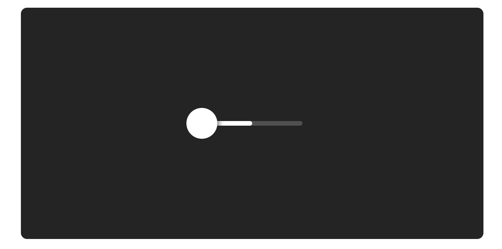

# Slider组件的元素

你现在要做的第一件事就是用一些视觉元素装扮一下Slider这个组件。你会用到Frame标签来作为Slider组件的元素同时利用它的一些属性来实现定位和样式。

一个Slider是由轨道，以及沿着轨道可以拖动的滑块，以及跟着滑块的一根进度条组成的。进度条和滑块的颜色有明显的对比，这样就能更好地显示出整体进度的值。

打开Slider.tsx文件然后让我们开始吧。



### 创造一根轨道 Create a Rail

在Slider.tsx文件中，你开始着手的第一个元素就是这根轨道。你需要改变一下现有的Frame标签的属性让它看起来像一根轨道。

你需要去给Frame标签添加一个固定的宽（width）和高（height）巨型，然后让其居中在整个画面中（center）。接着再用圆角属性（boder radius）再给它添加漂亮的圆角，同时给背景设置一个20%的透明度。

```jsx
<Frame
  name={"Rail"}
  width={130}
  height={6}
  center
  radius={3}
  background={"rgba(255,255,255,.2)"}
/>
```


### 创造一个滑块 Create a Knob

现在你已经有一个轨道了，现在要在它上面去添加一个圆形的滑块。你需要在轨道（Rail）这个标签里面放入滑块的标签（knob），所以你要先对现有的代码做一些调整。

 - 把作为轨道的Frame标签从自闭合的单标签改成前后闭合的双标签。

 - 在轨道这个标签内部添加一个新的Frame标签用来实现滑块（knob）

现在你的结构已经搭好了，开始添加属性到你作为滑块的Frame标签上吧

滑块是原型的而且和滑轨是中间对齐——即Y轴方向上居中对齐。为了增加对比和层次，给滑块添加一个纯白的背景和一些投影，这样滑块就能像是浮在滑轨上一样了。

你还要设置滑块的中心刚好在轨道的起始位置，为了实现这个效果，你需要让滑块向左偏移它自身一半的距离，照着可以通过left属性来实现。

```jsx
<Frame
  name={"Rail"}
  width={130}
  height={6}
  center
  radius={3}
  background={"rgba(255,255,255,.2)"}
>
  <Frame
    name={"Knob"}
    size={40}
    center={"y"}
    radius={"50%"}
    background={"#fff"}
    shadow={"0 2px 8px 1px #242424"}
    left={-20}
  />
</Frame>
```


### 创造一个进度条  Create a Fill

最后你需要做的是一根当你的拖动滑块的时候可以跟着你的滑块一起移动的进度条。你想要滑块（knob）在视觉上看起来是挡在进度条前面的，那你需要去调整一下Frame标签的顺序。

 - 在轨道的Frame标签中添加一个新的Frame标签作为进度条。

 - 确保在代码中进度条的Frame标签是在滑块Frame标签的前面，这样就能保证你想要的显示的效果。

进度条需要一个纯白的背景色同时它的高以及圆角都要和轨道是一样的。现在先把进度条的宽度设置为轨道宽度的一半。这样看起来虽然是不对的，但是没有关系，你会在接下来的步骤中调整它。

现在你已经把一个Slider组件所需要的元素都做出来了，现在是时候去让滑块可以拖拽，同时让进度条正常地运作起来了。

```jsx
<Frame
  name={"Rail"}
  ...
>
  <Frame
    name={"Fill"}
    width={65}
    height={6}
    radius={3}
    background={"#fff"}
  />
  <Frame
    name={"Knob"}
    ...
  />
</Frame>
```


